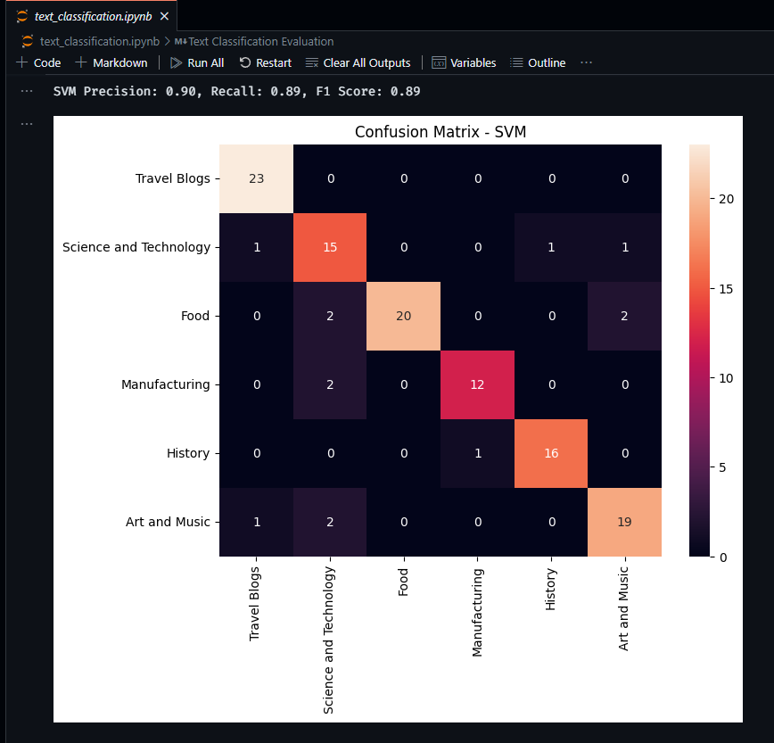
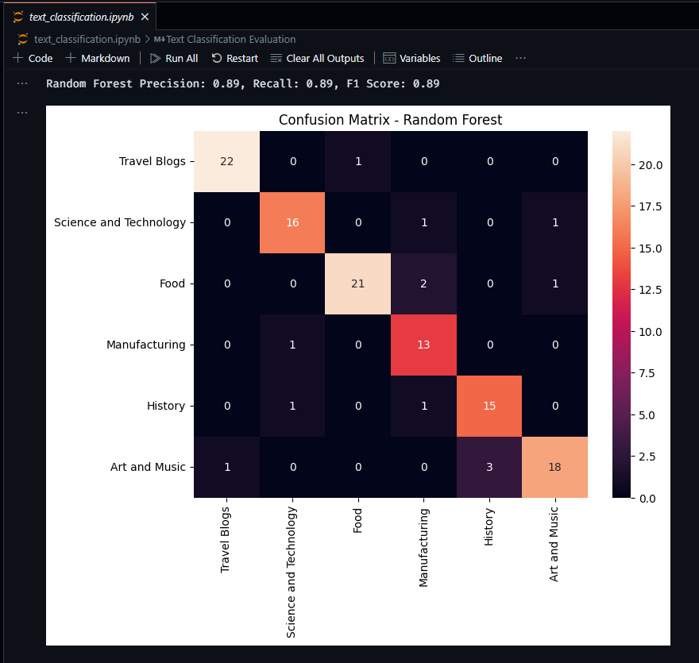
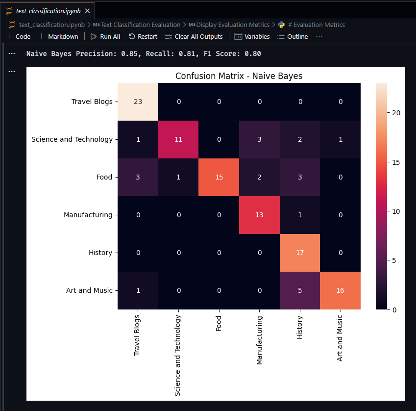
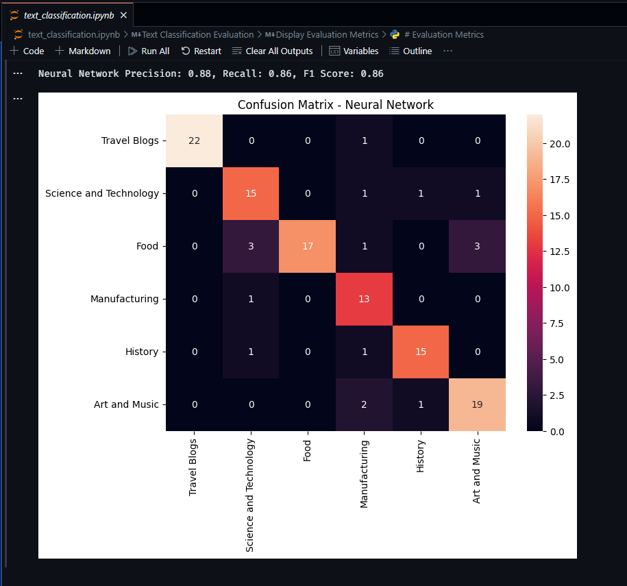

# YouTube Text Classification Project

This project consists of two Jupyter Notebook files for scraping YouTube data (`youtube_scraper.ipynb`) and performing text classification (`text_classification.ipynb`). The scraped data is stored in `youtube_data.csv`.

## Dependencies

Ensure you have the following dependencies installed to run the Jupyter Notebooks:

- `google-api-python-client`: Used for interacting with the YouTube Data API.
- `pandas`: Required for handling and manipulating data.
- `scikit-learn`: Used for machine learning and text classification tasks.
- `matplotlib` and `seaborn`: Used for visualizing evaluation metrics.
- `python-dotenv`: Used for loading environment variables from a `.env` file.

Install the dependencies using the following command:

```bash
pip install google-api-python-client pandas scikit-learn matplotlib seaborn python-dotenv
```

## Setting Up API Key and Virtual Environment

1. Create a .env file in the root directory of the project.

2. Add your YouTube Data API key to the .env file:
    
    ```bash
    API_KEY=your_api_key_here
   ```
- Ensure there are no spaces around the equal sign.

3. Create and activate the virtual environment. If your virtual environment is named yt_scrape, use the following commands:

    ```bash
    python -m venv yt_scrape
    source yt_scrape/bin/activate
   ```
- On Windows, use yt_scrape\Scripts\activate
        
## Running the Jupyter Notebooks

1. Open and run `youtube_scraper.ipynb` to scrape YouTube data and save it to `youtube_data.csv`.

2. Open and run `text_classification.ipynb` to perform text classification on the scraped data.

## Model Evaluation Metrics
Display precision, recall, and F1 scores for each model:
```
| Model           | Precision | Recall | F1 Score |
| --------------- | --------- | ------ | -------- |
| SVM             |   0.90    |  0.89  |   0.89   |
| Random Forest   |   0.89    |  0.89  |   0.89   |
| Naive Bayes     |   0.85    |  0.81  |   0.80   |
| Neural Network  |   0.88    |  0.86  |   0.86   |
```

## Confusion Matrices
Display confusion matrices for each model:

- **SVM Confusion Matrix:**


- **Random Forest Confusion Matrix:**


- **Naive Bayes Confusion Matrix:**


- **Neural Network Confusion Matrix:**


## Author
Vaibhav Srivastava

GitHub: [ZeusSama0001](https://github.com/ZeusSama0001)

## License

This project is licensed under the MIT License. See the [LICENSE.txt](LICENSE.txt) file for more details.